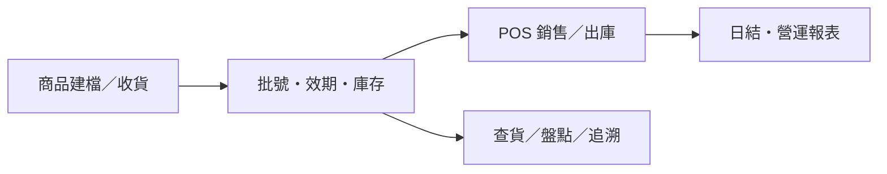

<div align="center">

# 💊 PharmaSaaS

**單店藥局營運工作台**

把商品、批號效期庫存、門市 POS、會員與營運報表放進同一套資料流程。  
**先讓一家藥局每天用得穩，再談擴充。**


[專案定位](#-專案定位) · [作業流程](#-作業流程) · [功能現況](#-功能現況) · [目前進度](#-目前進度) · [架構](#-架構) · [快速開始](#-快速開始) · [文件](#-文件)

</div>

---

## 🎯 專案定位

PharmaSaaS 是以**單店藥局**為第一個落地場景的管理系統。門市 POS 與管理後台共用 API、商品、交易與庫存資料；長期目標是減少重複輸入、協助追蹤每批藥品的來源與去向。

> **現在能做什麼？** POS、商品／批次庫存、會員與報表等功能已有程式實作，且部分可靠性問題已有自動化測試證據。**尚未通過實店端到端驗收，不應視為已可正式營運上線。** 最新交付和驗收門檻以 [單店藥局整備總追蹤 #37](https://github.com/skydreamer0/startup/issues/37) 為準。

## 🔄 作業流程

以下是**目標工作流程**，用來說明模組如何串起來；不是宣稱全部流程都已交付或驗收。



**設計原則：** 交易與庫存共用一套過帳規則；OCR 先產生待覆核草稿，不能直接改庫存；處方出庫須經藥師覆核。

## 🧩 功能現況

| 工作區 | 已有程式實作／已交付切片 | 主要待完成／待驗收 |
|---|---|---|
| **門市 POS** | 員工登入、商品查找、購物車、掛單、折扣、結帳與退款登記；部分重送／重啟復原與掃碼防誤加 | 唯一單號與金額規則的完整驗收、實體退貨流程、設備與實店測試 |
| **商品與庫存** | 商品／分類／供應商、批號效期、庫存異動；部分 FEFO 扣庫與持久化批次分攤 | 庫位／移位、完整收退貨、更正對帳、全入口一致性 |
| **收貨與辨識** | 初次批次收貨過帳、匯入預覽與人工確認的部分基礎 | 有碼／無碼收貨閉環、照片與單據 OCR 草稿、原圖留存和覆核 |
| **會員與營運** | 會員標籤與購買紀錄、LINE 推播介面、訂單／費用／日結／毛利等報表 | 外部服務正式串接、真店流程和報表對帳驗收 |
| **管理與部署** | RBAC 權限、操作稽核、Excel／CSV 匯入匯出、管理後台 | 正式環境憑證／readiness、備份還原、店內主機與列印設備實測 |

**狀態說明：**「已有程式實作」不等於已完成所有驗收；其中的可靠性改善是部分交付，不能據此推論全部收貨、銷售與庫存流程都已可正式啟用。

<details>
<summary>尚未支援或需要外部設定的整合</summary>

- LINE 整合需設定憑證；會計同步目前為 adapter／mock provider，QuickBooks、Xero 尚未正式串接。
- 拆分付款可記錄交易，但不代表已串接刷卡或 LINE Pay 金流。
- 離線佇列尚未接入正式結帳，**不能作為離線收銀**。
- OCR／本地 AI、處方照片辨識、外盒 QR 實體列印尚未完成；電子發票串接延後。
- Mac mini 為候選店內主機；得力標籤機相容性與真實硬體流程尚待確認。

</details>

## 🗺️ 目前進度

**已取得部分工程驗證：**

- **庫存／批次：** POS 與一般訂單的部分共用扣庫、合格 FEFO、批次分攤追溯，及退款登記不直接回補實體庫存。詳見 [#29](https://github.com/skydreamer0/startup/issues/29)。
- **結帳可靠性：** 部分冪等命令、原始結果查回與重啟復原已交付；整體結帳驗收仍未完成。詳見 [#30](https://github.com/skydreamer0/startup/issues/30)。
- **操作改善：** 掃碼防誤加、供應商資料、低庫存查詢與商品分頁已有交付切片；完整查碼與庫存即時刷新仍需驗證。詳見 [#31](https://github.com/skydreamer0/startup/issues/31)。

**接下來的優先順序：**

1. **先確保帳實正確：** 完成庫存一致性、結帳重送／競爭、唯一單號與可稽核更正。
2. **再接完整操作：** 有碼／無碼收貨、人工覆核 OCR 草稿、庫位／移位、調貨與處方出庫。
3. **最後驗證實際上線：** 店內主機、資料庫與原圖備份還原、行動端／Safari、標籤真機列印及實店驗收。

[查看完整交付／驗收門檻 #37](https://github.com/skydreamer0/startup/issues/37)。工程 Roadmap 也保留了歷史切片與測試紀錄；**歷史「完成」不代表實店驗收已通過**。

## 🏗️ 架構

兩個操作介面，共用一套 API 與資料庫；目前維持模組化單體架構。

```text
門市 POS   pos-ui   ─┐
                    ├── Express API ── Prisma ── PostgreSQL
管理後台   admin-ui ─┘   backend
```

前端使用 **React 19／Vite 6**，後端使用 **Express 5／Prisma 6**。程式集中於 `systems/enterprise-admin`；前端及 `packages/types` 由 pnpm workspace 管理，Backend 保留獨立 npm 安裝邊界。[查看依賴管理規則](systems/enterprise-admin/infrastructure/standards/dependency_management.md)

## 🚀 快速開始

需要 **Node.js 22（至少 22.12）、npm 11.21.0、pnpm 10.34.6、Docker Compose**，以及此儲存庫的存取權限。目前使用開發環境啟動流程，完整設定與指令如下。

<details>
<summary><strong>展開本機設定與啟動步驟</strong></summary>

以下指令使用 Bash；Windows 可使用 Git Bash 或 WSL。

**1. 取得專案與啟動資料庫**

```bash
git clone https://github.com/skydreamer0/startup.git
cd startup/systems/enterprise-admin
npm install --global npm@11.21.0 pnpm@10.34.6
npm --prefix backend ci
pnpm install --frozen-lockfile
docker compose up -d postgres
```

**2. 設定後端環境變數**

建立 `backend/.env`，替換以下佔位符。資料庫帳號、密碼須與 [Compose 的 postgres 設定](systems/enterprise-admin/docker-compose.yml) 一致；本機連線埠為 **5433**。

```dotenv
DATABASE_URL="postgresql://<user>:<password>@localhost:5433/enterprise_admin"
JWT_ACCESS_SECRET="<replace-with-a-random-secret-at-least-32-characters>"
JWT_REFRESH_SECRET="<replace-with-a-different-random-secret-at-least-32-characters>"
NODE_ENV=development
PORT=3000
CORS_ORIGIN=http://localhost:5173
```

兩組 JWT secret 應分別產生。可各執行一次以下指令，將輸出填入對應欄位：

```bash
node -e "console.log(require('node:crypto').randomBytes(32).toString('hex'))"
```

完整設定以 [`backend/src/config/env.ts`](systems/enterprise-admin/backend/src/config/env.ts) 為準。LINE 憑證為選填；未設定時不啟用 LINE 整合。兩個前端的開發伺服器皆已將 `/api` 代理至後端。

**3. 初始化本機資料庫**

以下指令仍從 `systems/enterprise-admin` 執行。請使用可重建的本機開發資料庫，並先確認 PostgreSQL 已就緒。

```bash
npm --prefix backend run db:generate
npm --prefix backend run db:migrate
npm --prefix backend run db:seed
```

開發用帳號與 POS 員工代碼由 [`backend/prisma/seed.ts`](systems/enterprise-admin/backend/prisma/seed.ts) 建立。Seed 僅供開發及測試，請勿將範例帳號、密碼或資料直接用於正式環境；`.env` 不應提交至 Git。

**4. 啟動服務**

開啟三個終端機，皆切換至 `systems/enterprise-admin`，分別執行：

```bash
npm --prefix backend run dev          # API       http://localhost:3000
pnpm --filter admin-ui run dev         # 管理後台  http://localhost:5173
pnpm --filter pos-ui run dev           # 門市 POS  http://localhost:5174
```

API 基底路徑為 `/api/v1/admin`，健康檢查位於 `http://localhost:3000/health`。正式環境的遷移、備份與部署流程請見 [Production Runbook](systems/enterprise-admin/infrastructure/standards/production_runbook.md)；目前 Compose 含開發用設定，部署前須完成憑證、機密與資料庫網路設定。


</details>

<details>
<summary>建置、測試與驗證指令</summary>

以下指令從 `systems/enterprise-admin` 執行：

| 工作 | 指令 |
| --- | --- |
| 建置各應用程式 | `pnpm run build` |
| 執行套件測試 | `pnpm run test` |
| 執行現有 lint 檢查 | `pnpm run lint` |
| 檢查共用型別 | `pnpm --filter @pharmasaas/types run typecheck` |
| 安裝 POS E2E 瀏覽器 | `pnpm --filter pos-ui run test:e2e:install` |
| 執行 POS E2E | `pnpm --filter pos-ui run test:e2e` |

後端整合測試需要已初始化的 PostgreSQL。POS E2E 另需已安裝的 Chromium，以及運行中的後端與 POS 開發伺服器。詳細範圍見 [測試策略](systems/enterprise-admin/infrastructure/standards/test_pyramid.md) 與 [CI 設定](.github/workflows/ci.yml)。


</details>

## 📚 文件

| 想了解什麼 | 從這裡開始 |
|---|---|
| **現在要做什麼** | [單店整備與驗收 #37](https://github.com/skydreamer0/startup/issues/37) · [既有工程 Roadmap](systems/enterprise-admin/ROADMAP.md) |
| **程式在哪裡** | [系統與模組導覽](systems/enterprise-admin/CONTEXT.md) · [架構決策 ADR](systems/enterprise-admin/infrastructure/adr/) |
| **資料如何串接** | [API 規格](systems/enterprise-admin/infrastructure/api/api_spec.md) · [Prisma Schema](systems/enterprise-admin/backend/prisma/schema.prisma) |
| **如何部署與維護** | [Production Runbook](systems/enterprise-admin/infrastructure/standards/production_runbook.md) |
| **如何參與開發** | [AGENTS.md](AGENTS.md) · [Git 工作流程](systems/enterprise-admin/infrastructure/standards/git_workflow.md) · [PR 範本](.github/pull_request_template.md) |

功能與驗收進度以目前追蹤議題為準；既有 Roadmap 的歷史完成紀錄不代表實店已驗收。
