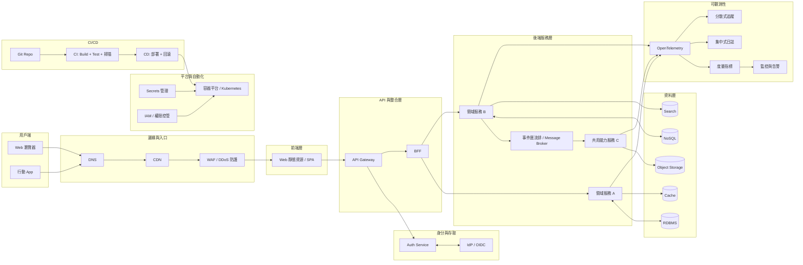
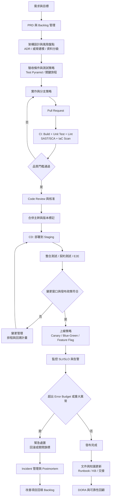

# 開發專案技術架構與制度架構分析報告

## 執行摘要

本報告以中大型網路應用專案為假設前提，整理目前常見的技術架構組件與彼此的邏輯關係，並以制度層面的角度，提供可落地的流程、政策與權責設計範本，便於直接移作內部簡報與治理基準。citeturn0search16turn6search8turn0search28

核心結論是：技術架構可視為分層與解耦的系統組合，通常以「入口層與前端」承接用戶體驗，以「API 與服務層」承接交易與領域邏輯，以「資料層」承接狀態與一致性，再由「平台與自動化」提供可重複部署與彈性擴展，並以「可觀測性」與「資安控制」作為跨層的共通底座。citeturn4search16turn1search2turn0search6turn0search3

制度層面建議以可度量的交付與可靠性目標驅動，例如採用 DORA 指標追蹤交付效率，採用 SLI/SLO 與 Error Budget 將可靠性要求轉為可執行的發布與變更政策，並把審查、測試、掃描、部署與回滾流程整合在同一套 CI/CD 治理鏈路內。citeturn2search3turn3search6turn3search2turn5search0

## 範圍與假設

本報告未指定產業、專案規模或技術棧，採用的預設情境如下：

假設系統為中大型網路應用，具備多前端渠道（Web 與行動端），後端以多模組或多服務承載，部署於公有雲或混合雲，需面對尖峰流量、數據安全、持續迭代、可用性與營運成本等綜合約束。citeturn6search8turn0search16turn6search1

本報告使用的架構品質面向，對齊主流雲端架構框架常見支柱，例如可靠性、安全性、成本最佳化、效能效率與營運卓越，作為技術與制度設計的共同語言。citeturn0search16turn6search8turn6search1

## 現行開發專案的技術架構與邏輯關係

技術架構可用「層次」與「橫切能力」來理解。層次處理請求與數據流，橫切能力處理可運維性與風險控制，兩者共同決定系統的可擴展、可維護與可治理程度。citeturn4search16turn1search2turn0search6

層次與邏輯關係建議用以下語法描述：

用戶端與入口層負責就近分發、保護與加速，常見包含 DNS、CDN、WAF 與流量入口。這類設計通常用來降低延遲並吸收攻擊與突發流量。citeturn0search16turn6search8turn6search1

前端層負責使用者互動與呈現。對中大型產品，前端通常以多端並行並需要可獨立交付的部署節奏，與後端以 API 契約協作。citeturn4search0turn1search0

API 與整合層通常包含 API Gateway 與 BFF。BFF 的目的在於把後端服務與前端體驗解耦，針對不同客戶端提供更貼近需求的聚合與裁切，降低前端對多服務細節的耦合度。citeturn4search0turn0search9

服務層承載領域邏輯與交易流程。若採微服務風格，服務應在明確邊界內實作特定商務能力，並具備可獨立部署與演進的特性。citeturn0search1turn0search5turn0search25

資料層通常並存多種存儲以匹配不同需求，例如關聯式資料庫承擔一致性交易，快取承擔讀取與熱點，搜尋引擎承擔全文檢索，物件儲存承擔非結構化物件。資料選型常與服務邊界共同設計，避免跨界共享資料表導致耦合擴散。citeturn0search5turn4search16

非同步與事件驅動在中大型系統常用於降低同步耦合與提升可擴展。事件驅動架構以事件作為狀態變更的載體，透過發佈與取用形成鬆耦合服務組合，便於獨立擴展與獨立部署。citeturn4search13turn4search1turn4search16

平台與基礎設施層通常以容器與編排平台支撐部署彈性與隔離。以 Kubernetes 參考架構而言，叢集由控制平面與工作節點組成，控制平面管理節點與工作負載，節點負責承載 Pod。此結構常作為多服務工作負載的底層容器編排基座。citeturn4search19turn4search3

可觀測性與日誌為跨層能力，目的在於把系統執行狀態以可查、可量測、可追溯形式輸出。OpenTelemetry 提供供應商中立的可觀測性框架，覆蓋 traces、metrics、logs 等信號，並在規格中強調多信號關聯能力。Prometheus 作為常見監控系統，強調可靠性與時間序列度量模型，常成為告警與診斷的核心組件。citeturn0search6turn0search26turn6search7turn6search3

資安同樣為跨層能力，需在設計、實作、測試、部署、運維的生命週期內落實。OWASP ASVS 提供可用於檢測 Web 應用技術安全控制的需求基準，適合作為安全驗證清單與門檻；NIST SSDF 提供可嵌入 SDLC 的高階安全開發實務集合，適合作為制度層面的安全開發框架。citeturn0search3turn3search0turn3search15

image_group{"layout":"carousel","aspect_ratio":"16:9","query":["cloud native reference architecture diagram","microservices architecture diagram","CI CD pipeline diagram","observability metrics logs traces diagram"],"num_per_query":1}

### 一頁式系統架構圖

下圖以「用戶流量路徑」與「交付與治理路徑」雙軸呈現，適用於中大型網路應用專案的通用參考架構。其設計意圖是把前端體驗、API 契約、服務邊界、資料責任、平台部署、自動化交付、可觀測性與資安控制放在同一張視圖裡，以便做架構決策權衡。citeturn0search16turn6search8turn5search0turn0search6

## 制度層面架構與流程

制度設計可視為把「交付品質、可靠性與資安風險」轉為可執行、可稽核、可度量的工作流與政策集合。其核心是把工程活動的輸入輸出物標準化，並在關鍵節點設置門檻與責任歸屬。citeturn5search0turn3search6turn3search0turn7search0

制度常見骨架可用以下幾個維度表述：

開發流程採需求到上線閉環，必備的治理節點包含架構與風險評估、PR 與審查、CI 門檻、CD 發布策略、上線監控、事故處理與事後復盤。citeturn5search0turn5search11turn1search7turn3search6

版本控管與代碼審查是制度中最具槓桿的治理設計。Google 工程實踐的程式碼審查準則將審查目的聚焦在長期 code health 改善，強調審查的標準與取捨；GitHub 的受保護分支規則可把「必須通過狀態檢查」與「必須取得核准審查」轉為可執行的合併門檻。citeturn7search0turn2search5turn2search21

部署政策建議與可靠性目標綁定。SRE 對 SLO 與 Error Budget 的論述指出，Error Budget 可作為發布決策輸入，用於權衡創新與可靠性；SRE Workbook 也提供金絲雀發布作為降低變更風險的實務路徑。citeturn3search6turn3search3turn5search11

測試策略需同時覆蓋快回饋與端到端信心。ISTQB 將 Test Pyramid 定義為各層測試量體關係模型，底層測試量體較大；Google 的工程與雲端變更方法論也強調單元與整合測試的必要性，並配合覆蓋率追蹤與關鍵旅程整合測試。citeturn7search20turn7search5turn7search12

SLA 與運維制度建議以 SLI/SLO 驅動，將可靠性需求具體化，並用事件管理與復盤文化持續降低重複事故。SRE 的事故管理章節強調事前演練與角色分工的重要性。citeturn3search6turn3search2turn1search7

變更管理建議與可觀測性、回滾與發布策略整合。SRE Workbook 的組織變更管理章節把變更管理視為 SRE 核心責任之一，並提供從理論到個案的落地參考。citeturn5search1turn5search8

知識管理建議把文件視為交付物，將 Runbook、架構決策紀錄、事故復盤與操作手冊納入 Definition of Done，減少人員流動與交接成本。citeturn5search0turn1search7

合規與資安政策建議以「安全開發」與「供應鏈安全」雙軸落地。NIST SSDF 提供可嵌入 SDLC 的安全開發實務集合；OWASP SAMM 提供軟體安全成熟度模型，可用來規劃從現況到目標的能力建設路線；SLSA 提供可逐步採用的供應鏈安全規範；SBOM 的最小要素由 NTIA 提供報告，適合作為組件透明度的基準要求。citeturn3search0turn3search5turn5search2turn5search10

### 制度流程圖

此流程圖將「需求到上線」與「事故閉環」串接，並把 CI/CD 門檻、變更審核與知識沉澱放入同一路徑。流程中的量測點可直接對齊 DORA 指標與 SLO 治理。citeturn2search3turn3search6turn5search0turn7search0

## 架構與流程選項比較與權責矩陣

此處提供三類可直接套用的治理產物：架構選項比較表、權責矩陣、制度落地要點。架構選型建議以「變更頻率、團隊規模、可靠性目標、資料一致性需求、運維能力」作為決策輸入，再以 Well Architected 類框架做全面性權衡。citeturn0search16turn6search8turn0search28

### 常見架構或流程選項比較表

下表的「風險與成本」以相對等級估計，便於在未指定技術棧與組織條件時進行初步篩選。各選項定義參考微服務、BFF、事件驅動與雲端架構指南等官方文件。citeturn0search1turn4search0turn4search13turn4search1turn0search16turn6search8

| 選項 | 優點 | 缺點 | 適用情境 | 實作要點 | 主要風險 | 成本估計（初期/長期） |
|---|---|---|---|---|---|---|
| 單體（Monolith） | 開發路徑短，部署鏈路相對單純，交易一致性較直觀 | 隨規模擴大，部署與修改風險集中，團隊協作衝突增加 | 產品早期，中小團隊，需求變動快但域較集中 | 模組邊界先行，資料存取規範化，避免共享全域狀態 | 後期拆分成本高，技術債堆積 | 低 / 中高 |
| 模組化單體（Modular Monolith） | 保留單體部署簡單性，降低內部耦合，為未來拆分鋪路 | 邊界需嚴格治理，否則退化為一般單體 | 中期成長，已出現多域但尚未到多團隊獨立部署 | 明確 bounded context，模組 API 契約化，資料權責分明 | 边界鬆動導致隱性耦合，拆分延遲 | 中 / 中 |
| 微服務（Microservices） | 可獨立部署與擴展，針對商務域分工，促進演進速度 | 分散式複雜性提高，需成熟 DevOps 與觀測能力 | 多團隊並行，高變更頻率，需局部擴展與故障隔離 | 服務邊界設計，服務間通訊與版本策略，去中心化資料管理 | 分散式交易與一致性難題，觀測與故障排查成本上升 | 高 / 高 |
| 無伺服器（Serverless） | 以事件或請求觸發，彈性伸縮，減少基礎設施維護負擔 | 受限於平台限制，冷啟動與可觀測性治理需設計 | 事件驅動任務，間歇性流量，快速試驗與彈性成本 | IaC 管理，最小權限，觀測與追蹤整合 | 供應商鎖定，架構碎片化，跨函數流程治理困難 | 中 / 中高 |
| BFF（Backends for Frontends） | 前後端解耦，針對不同客戶端聚合與裁切，提升體驗與交付效率 | 增加一層服務與維護點，需避免重複邏輯擴散 | 多前端渠道與差異化需求，後端服務較多 | BFF 與後端 API 契約，快取與安全策略一致化 | BFF 變成第二個單體，版本治理不當 | 中 / 中 |
| 事件驅動（Event Driven） | 鬆耦合，擴展性佳，可支援非同步處理與重播 | 事件一致性與冪等要求高，除錯與追溯更複雜 | 高併發，跨域整合，需要非同步削峰與解耦 | 事件模型與 Schema 管理，冪等與重試策略，事件追蹤 | 事件風暴，資料最終一致性帶來體驗與對帳成本 | 中高 / 高 |

補充：微服務、BFF、事件驅動的概念與建議可參考 entity["company","Microsoft","software company"] 的 Azure Architecture Center 相關模式文件；雲端架構品質權衡可參考 entity["company","Amazon Web Services","cloud provider"] 與 entity["company","Google Cloud","cloud provider"] 的 Well Architected 類框架。citeturn0search1turn4search0turn4search13turn0search16turn6search1

### 角色與權責矩陣

此 RACI 以中大型產品常見角色配置為例，目標是把「決策責任 A」與「執行責任 R」清楚分離，降低跨部門扯皮成本，並讓交付門檻能在制度上運作。citeturn5search0turn7search0turn1search7turn3search0

角色定義：
- DEV 開發（前後端）
- QA 測試
- PO 產品（含需求與驗收）
- SRE/OPS 運維與可靠性
- SEC 資安
- PM 專案管理
- ARCH 架構師

| 活動/交付物 | DEV | QA | PO | SRE/OPS | SEC | PM | ARCH |
|---|---|---|---|---|---|---|---|
| 需求盤點與 PRD 驗收準則 | R | C | A | C | C | R | C |
| 架構設計與 ADR | R | C | C | C | C | I | A |
| 威脅建模與資料分級 | C | I | C | C | A | I | R |
| API 契約與版本策略 | R | C | C | C | C | I | A |
| 開發實作與單元測試 | A/R | C | I | I | C | I | C |
| 測試計畫與自動化測試 | C | A/R | C | C | C | I | C |
| 代碼審查與合併門檻 | A/R | I | I | C | C | I | C |
| CI 規範（建置、測試、掃描門檻） | R | C | I | A | C | I | C |
| CD 與發布政策（Canary、回滾） | C | C | I | A/R | C | I | C |
| 監控、告警與 SLO 制定 | C | I | C | A/R | C | I | C |
| 事故處理與 Postmortem | C | I | I | A/R | C | I | C |
| 合規稽核、弱點管理與供應鏈安全 | C | I | I | C | A/R | I | C |

配套制度建議把 RACI 與工具配置綁定，例如在 entity["company","GitHub","software platform company"] 以受保護分支規則落實審查與狀態檢查門檻，在 entity["company","GitLab","devops platform company"] 以 CI/CD 組態檔落實流水線與安全掃描，在 entity["organization","OWASP","web security nonprofit"] 以 ASVS 管理安全驗證清單。citeturn2search5turn2search0turn0search3turn0search1

## 結論與改進建議

整體建議以「先制度後工具、先量測後優化」推進，讓架構與制度形成可持續迭代的治理系統。度量面建議以 DORA 與 SLO 組合掌握交付效率與可靠性風險。資安面建議把 SSDF、ASVS、SAMM 與供應鏈實務納入 SDLC 的必選項。citeturn2search3turn3search6turn3search0turn3search5turn5search10

### 改進建議清單

優先序定義：P0 立即降低高風險或高返工，P1 建立可持續交付能力，P2 擴充治理深度與組織能力。

| 期程 | 優先序 | 建議 | 主要落地工作 | 預期效益 |
|---|---|---|---|---|
| 短期（四至八週） | P0 | 建立合併門檻與可重複發布 | 主幹分支加上必須審查與必須通過狀態檢查；CI 先落實建置、單元測試、Lint、基礎 SAST/SCA；CD 先落實可回滾與發布紀錄 | 降低品質漂移與手動風險，縮短回歸成本citeturn2search5turn2search21turn2search0turn5search0 |
| 短期（四至八週） | P0 | 定義最小 SLO 與告警規則 | 選 1 至 3 條關鍵旅程定義 SLI/SLO；建立 Error Budget 政策草案；告警與值班輪值先覆蓋高影響路徑 | 讓可靠性具體化，將發布決策與風險掛鉤citeturn3search6turn3search2turn1search7turn3search7 |
| 中期（兩至四個月） | P1 | 架構視圖與邊界治理制度化 | 建 ADR 與架構圖規範；若採微服務，補齊服務邊界、版本策略與通訊模式；若採 BFF，明確 BFF 職責與重用規範 | 降低架構漂移，提升跨團隊協作效率citeturn0search1turn4search0turn0search25turn4search16 |
| 中期（兩至四個月） | P1 | 可觀測性平台統一 | 以 OpenTelemetry 統一 traces、metrics、logs 的標準；建立服務儀表板與核心告警；導入變更事件標記，支援發布後追蹤 | 降低 MTTR，提升根因分析效率citeturn0search6turn0search26turn6search7turn1search7 |
| 中期（兩至四個月） | P1 | 測試策略分層與關鍵旅程保障 | 用 Test Pyramid 定義比例與責任；補齊整合測試與契約測試；以覆蓋率與關鍵旅程測試做為合併門檻的一部分 | 降低回歸與線上缺陷，提升交付穩定性citeturn7search20turn7search5turn7search12 |
| 長期（六至十二個月） | P2 | 安全開發成熟度與合規能力建設 | 以 NIST SSDF 作為 SDLC 安全主骨架；以 OWASP SAMM 設定成熟度目標；以 OWASP ASVS 對齊安全驗證清單與測試覆蓋 | 降低漏洞密度與合規風險，形成可持續安全交付能力citeturn3search0turn3search5turn0search3 |
| 長期（六至十二個月） | P2 | 供應鏈安全與 SBOM 常態化 | 逐步導入 SLSA 等級要求與 provenance；建立 SBOM 生成與交付規範；把簽章與制品追溯納入發布鏈路 | 降低供應鏈攻擊面，提升可追溯性與採購信心citeturn5search2turn5search10turn5search3 |
| 長期（六至十二個月） | P2 | 以 DORA 與 SLO 驅動組織級改善 | 每月回顧 DORA 指標與 Error Budget 消耗；依數據調整發布節奏、變更門檻與技術債投入 | 建立量測驅動的持續改善機制citeturn2search3turn3search6turn5search0 |

## 參考來源

以下來源優先度以「官方或原始」為主，並涵蓋技術架構、交付流程、可靠性與資安治理四大面向：

優先參考：
- entity["company","Amazon Web Services","cloud provider"] Well Architected Framework（六大支柱與權衡語言）。citeturn0search16turn0search0turn0search24  
- entity["company","Microsoft","software company"] Azure Well Architected Framework（五大支柱與設計指引）。citeturn6search8turn6search16turn6search12  
- entity["company","Google Cloud","cloud provider"] Well Architected Framework（營運卓越、安全、可靠等支柱）。citeturn6search1turn0search28turn6search9  

技術架構與平台：
- Kubernetes 架構與組件（控制平面與節點的參考架構）。citeturn4search19turn4search3  
- OpenTelemetry 文件與規格（可觀測性信號與關聯設計）。citeturn0search6turn0search26  
- Prometheus 官方文件（監控系統定位與可靠性設計）。citeturn6search7turn6search3  

工程制度與交付：
- entity["organization","DORA","devops research group"] 指標指南（交付效率與穩定性的四項核心度量）。citeturn2search3  
- entity["book","Site Reliability Engineering","google sre book 2016"] 與 entity["book","The Site Reliability Workbook","google sre workbook 2018"]（SLO、Error Budget、發布工程、事故管理、變更管理）。citeturn3search6turn3search2turn5search0turn1search7turn5search1  
- Google Engineering Practices（程式碼審查準則）。citeturn7search0turn7search4turn7search8  
- entity["company","GitHub","software platform company"] 受保護分支與必備審查機制。citeturn2search5turn2search21  
- GitLab CI/CD 官方文件與 .gitlab-ci.yml 概念。citeturn2search0  

資安與供應鏈：
- entity["organization","NIST","us standards institute"] SSDF（SP 800 218，安全開發實務框架）。citeturn3search0turn3search15  
- entity["organization","OWASP","web security nonprofit"] ASVS 與 SAMM（安全驗證基準與成熟度模型）。citeturn0search3turn3search5  
- entity["organization","Open Source Security Foundation","linux foundation project"] SLSA（供應鏈安全規範與等級）。citeturn5search2turn5search5  
- entity["organization","NTIA","us telecom agency"] SBOM Minimum Elements（SBOM 最小要素基準）。citeturn5search10turn5search3  

補充規格：
- entity["organization","Semantic Versioning","versioning specification"] 2.0.0（版本格式與遞增規則）。citeturn1search1  
- OpenAPI Specification（API 描述標準與用途）。citeturn1search0