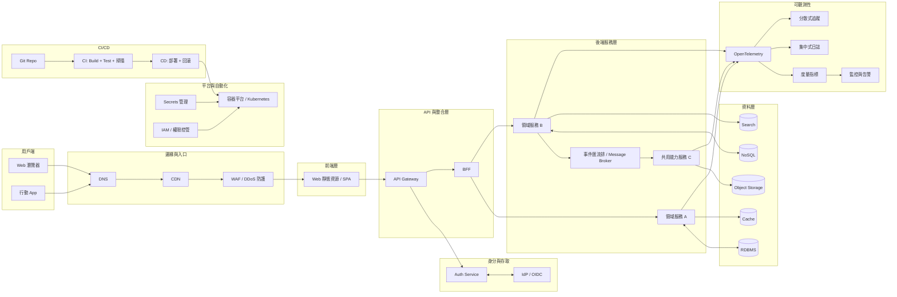

# System Architecture Specification

## 1. Purpose
Define the system architecture, dependencies, API standards, and infrastructure for the enterprise platform. This documentation serves as the source of truth for all development and deployment activities.

## 2. Engineering Standards
1. **Implementation Order**: DB Schema -> API Spec -> Backend Implementation -> Frontend UI -> Integration Testing.
2. **Naming Conventions**: Aligned with the global Data Dictionary. All fields must use `snake_case` across DB and API.
3. **Security**: Mandatory RBAC (Role-Based Access Control) for all endpoints.
4. **Reliability & Observability**: Driven by SLI/SLO, Error Budgets, and OpenTelemetry standards.

---

## 3. One-Page Architecture Diagram

---

## 4. Architecture Blueprint

### A. Governance & Standards
- [Engineering Standards & Policies](standards/README.md)
- [Architecture Decision Records (ADR)](adr/README.md)

### B. Frontend Architecture
- [Tech Stack & State Management](frontend/tech_stack.md)
- [UI Components & Layout](frontend/ui_components.md)
- [Routing & Permissions](frontend/routing.md)
- [API Client & Interceptors](frontend/api_client.md)

### C. Backend Architecture
- [Backend Framework & Server Config](backend/backend_config.md)
- [Database Schema Definition](backend/database_schema.md)
- [API Gateway & Routing](backend/api_gateway.md)
- [RBAC Middleware Implementation](backend/rbac_middleware.md)

### D. API & Integration
- [RESTful & GraphQL Spec](api/api_spec.md)
- [Websocket & Real-time Updates](api/websockets.md)
- [Error Codes & Response Format](api/error_handling.md)

### E. Infrastructure & DevOps
- [CI/CD Deployment Pipelines](devops/cicd_pipeline.md)
- [Environment Variables & Secrets](devops/environments.md)
- [Logging & Monitoring](devops/monitoring.md)

---

## 4. Version Control
1. All API breaking changes must be documented in the `CHANGELOG`.
2. Dependencies must be locked in `package-lock.json` or equivalent.
3. Frontend and Backend versions are managed independently.
