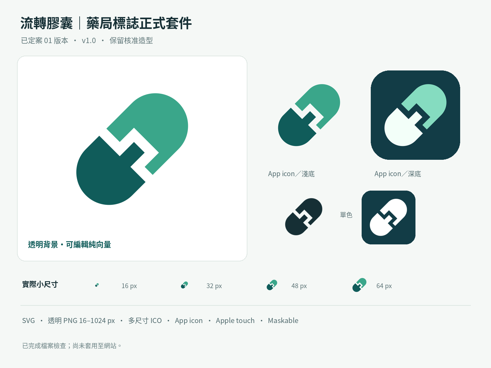

# 01 流轉膠囊品牌圖示

核准版本：2026-10-10，正式套件 1.0.0。圖形、旋轉角度、留白與配色直接沿用核准檔案，不重新繪製或改色。

## 來源與使用

- 核准 ZIP：Library `libfile_dc761d14eb7c81919def589538fad1a6`，`pharmacy-flow-capsule-v1.0-final-kit.zip`。
- 獨立主版 SVG：Library `libfile_5edfe3d37d0881919aa39d85fc708d8c`；與套件內主版逐位元組相同。
- 核准預覽：Library `libfile_d7187a719ca88191b7b0d14bb208af89`；與套件內預覽逐位元組相同。
- [套件說明與色票](approved-kit-README.txt)保留原始內容；[SHA256SUMS.json](SHA256SUMS.json)記錄兩個網站實際引用資產的 SHA-256。

Admin 與 POS 的 `public/brand/flow-capsule-v1/` 保存核准 favicon、Apple touch icon 與透明主版 `mark.svg`；POS 另有現有 manifest 的 App／maskable 圖示。核准淺底／深底 `mark-light.svg`／`mark-dark.svg` 位於各網站 `src/assets/brand/flow-capsule-v1/`，以 Vite 資產匯入，輸出為 `/assets/` 下具內容雜湊的 SVG URL（不內嵌、不改原檔）。登入頁、Admin 側欄、POS 頁首、顧客顯示頁首與既有 Admin POS 原型使用相應版本；圖片旁已有品牌文字，使用空 `alt` 避免重複朗讀。保留原品牌文字、操作與版面 class。

兩個網站提供 SVG／ICO／16、32 px PNG favicon，以及不透明 180 px Apple touch icon。HTML 引用遵循 Vite 的 BASE_URL，React 圖示匯入則由 Vite 處理部署 base 與內容雜湊。頁面圖片使用 browser harness 原已允許的 `/assets/` 路徑。dialog Chrome harness 另只接受同源、無 query 的 GET `favicon.svg`／`favicon-32.png`／`favicon-16.png` 三個版本化品牌路徑；來源與實際回應逐份核對固定 SHA-256、長度、MIME 及 HTTP 200，回應不跟隨 redirect、不自動重試，並保存獨立資產收據。未知品牌路徑、外站與未驗證回應仍由嚴格 network gate 拒絕。

## 現有 PWA

只有 POS 原有 `/manifest.json`（顧客顯示器）更新 `icons`：192／512 px 不透明一般圖示及獨立 512 px maskable 圖示。maskable 使用套件已有的 88% 等比例版本，圖形完整落在中央直徑 80% 的安全圓內。不得把一般版兼標為 maskable。

manifest 的名稱、start_url、scope、display、方向、theme_color 與 background_color 保留。既有 manifest 與 `/customer-display` 仍假設根路徑部署；這次不調整其部署範圍。Admin 不新增 manifest；兩個網站均不新增 service worker 或離線能力。

## 快取與更新限制

現有 Nginx 對 PNG／ICO／SVG 設定一年 `immutable` 快取。這次使用新版本 public 路徑 `/brand/flow-capsule-v1/` 及 Vite 輸出的圖片內容雜湊，讓取得新版 HTML／JavaScript／manifest 的用戶請求新 URL。未改 Nginx、CDN、Actions 或部署設定。未來換資產時須增加路徑版本，不能在相同 immutable URL 覆寫內容。

manifest URL 保持 `/manifest.json`，以維持既有安裝識別；此 JSON 不匹配目前 Nginx 的一年資產快取規則。實際部署平台／CDN 可能另有策略，部署後仍須核對 HTML、manifest 與圖示回應。瀏覽器、作業系統與已安裝 PWA 各有更新時機，**不能保證既有安裝立即換圖**；需要時可重新開啟網站，或移除後重新加入主畫面。這不是自動清除使用者快取的承諾。

## 驗證與交付邊界

來源校驗、SVG 安全性、PNG 尺寸／透明度、ICO 影格、maskable 安全圓、兩個網站型別／建置／資產 HTTP 路徑及 MIME 的執行結果記錄在 Draft PR。品牌更新不涉及 API、資料庫、權限、商品分類圖示或現有 #96 的布局修正。原始套件的商標、印刷及辨識測試限制仍適用。

CI/CD Pipeline 與 Dependency Review 在建立 PR 時觸發；一般 feature branch push 不觸發此 CI/CD 的 master/main push 規則。專案禁止 CI skip 標記，保留所有必要 gate。repository 未設定自動 Preview workflow／Vercel 設定檔，GitHub deployment 清單查無紀錄；這不保證外部平台沒有另外設定的觸發條件。只建立 Draft checkpoint，不合併或正式部署。
