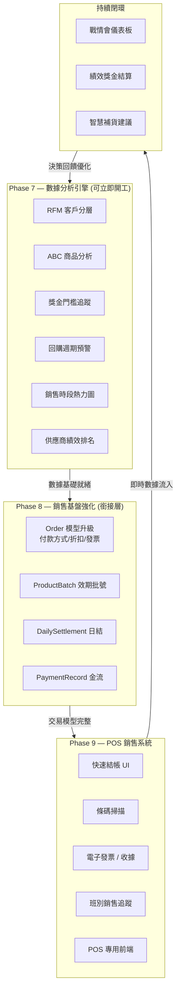
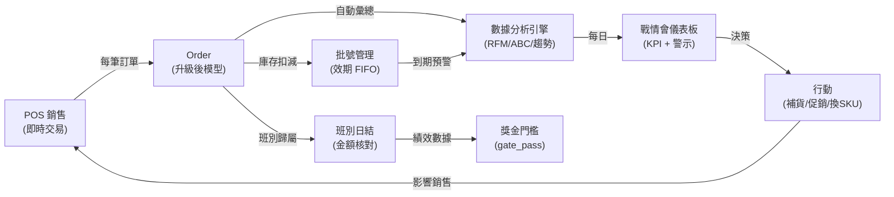

# 藥局管理系統 — 數據分析引擎 + 銷售系統 全局設計文件

> **目的**：規劃一套以「數據分析」為核心的模組體系，並預留與未來銷售系統（POS）的無縫銜接架構。
> **原則**：先用既有資料抽出分析價值 → 再擴展資料模型支撐銷售系統 → 最後形成完整閉環。

---

## 一、全局系統藍圖



---

## 二、Phase 7 — 數據分析引擎（可立即開工）

> **核心價值**：不需要任何 Schema 變更，100% 用既有資料產出分析結果。

### 模組 7-1：RFM 客戶分層分析

**資料來源**：`Customer.lastPurchaseDate` / `purchaseCount` / `totalSpent`

| 分層 | R 條件 | F 條件 | M 條件 | 建議行動 |
|------|--------|--------|--------|---------|
| 🏆 VIP | ≤7天 | ≥5次 | Top 20% | 特別關懷，防流失 |
| 💚 忠誠客 | ≤30天 | ≥3次 | 中位以上 | 推薦高毛利品 |
| 🌱 新客 | — | 1次 | — | 回購激勵 |
| ⚠️ 沉睡客 | 31-60天 | — | — | LINE 推播喚醒 |
| 🔴 流失高危 | >60天 | — | — | 緊急挽回機制 |

**後端 API**：`GET /analytics/rfm?period=2026-03`
**前端頁面**：`/analytics/rfm` — 分層圓餅圖 + 客戶名單 + 一鍵匯出

---

### 模組 7-2：ABC 商品分析（含毛利交叉）

**資料來源**：`OrderItem` JOIN `Product`，彙總營收/數量/毛利貢獻

| 象限 | 營收 | 毛利率 | 決策 |
|------|------|--------|------|
| ⭐ 明星品 | 高 | 高 | 主推、絕不缺貨 |
| 🐄 現金牛 | 高 | 低 | 協商降低進貨成本或調價 |
| 💎 隱藏寶石 | 低 | 高 | 加大推廣力度 |
| ❌ 瘦狗品 | 低 | 低 | 淘汰或停止進貨 |

**後端 API**：`GET /analytics/product-abc?period=2026-03`
**前端頁面**：`/analytics/product-abc` — 四象限散點圖 + 排行榜 + 分類統計

---

### 模組 7-3：獎金門檻即時追蹤

**資料來源**：既有 `AnalyticsService.getKpiSnapshot()` + `Expense`

**儀表板顯示**：
```
┌─────────────────────────────────────────────┐
│  本月獎金門檻狀態          2026-03 至今     │
│─────────────────────────────────────────────│
│  毛利率:   31.2%  ✅ (門檻 ≥30%)           │
│  CCC:      22 天  ✅ (門檻 ≤30天)          │
│  合規事件: 0 件   ✅ (門檻 =0)             │
│  ─────────────────────────────────         │
│  🟢 GATE PASS: 本月獎金可發放              │
│  預估獎金池: TWD 15,200                    │
└─────────────────────────────────────────────┘
```

**後端 API**：`GET /analytics/bonus-gate?period=2026-03`
**前端頁面**：整合在 `/dashboard` 或獨立 `/analytics/bonus`

---

### 模組 7-4：客戶回購週期 + 流失預警

**資料來源**：`Order.createdAt` 按 `customerId` 計算回購間隔

**計算邏輯**：
1. 對每個客戶計算歷史平均回購間隔（天數）
2. 當距上次購買超過 `1.5 × 平均間隔` → 標記「流失高危」
3. 藥局特殊指標：慢性病用藥客戶「30天未回購」= 紅色警報

**後端 API**：`GET /analytics/churn-risk`
**前端頁面**：`/analytics/churn` — 風險名單 + 預計流失日期 + LINE 推送按鈕

---

### 模組 7-5：銷售時段熱力圖

**資料來源**：`Order.createdAt` 提取 weekday + hour

**前端視覺化**：7×24 格的熱力圖（顏色深淺 = 訂單量 / 營收）

**老闆用途**：
- 哪個時段要排人？哪個時段可以少排？
- 促銷活動應該卡在哪個時段發動？

**後端 API**：`GET /analytics/heatmap?range=last30d`

---

### 模組 7-6：供應商績效排名

**資料來源**：`Supplier` + 關聯 `Product` 的銷售與庫存數據

**指標**：
- 供貨商品的總銷售額佔比
- 所供商品平均毛利率
- 到貨可靠度 (`deliveryReliability`)
- 瑕疵率 (`defectRate`)

**後端 API**：`GET /analytics/supplier-ranking`
**前端頁面**：`/analytics/suppliers` — 排行表 + 雷達圖

---

## 三、Phase 8 — 銷售基盤強化（為 POS 做準備）

> **核心目的**：擴展 Schema，讓 Order 模型從「後台手動建單」升級為「可承接即時銷售」。

### 8-1：Order 模型升級

現有 `Order` 缺少的關鍵欄位：

```prisma
model Order {
  // --- 新增欄位 ---
  orderNumber     String   @unique @map("order_number")     // 流水號 ORD-YYYYMMDD-XXXX
  orderType       String   @default("manual") @map("order_type")  // manual | pos | online
  paymentMethod   String?  @map("payment_method")           // cash | card | line_pay | transfer
  discountAmount  Float    @default(0) @map("discount_amount")
  discountReason  String?  @map("discount_reason")          // promo_code | member | manual
  taxAmount       Float    @default(0) @map("tax_amount")
  invoiceNumber   String?  @map("invoice_number")           // 電子發票號碼
  cashierId       String?  @map("cashier_id")               // 操作員 (FK to users)
  shiftId         String?  @map("shift_id")                 // 對應班別 (FK to shifts)
  completedAt     DateTime? @map("completed_at")            // 結帳完成時間
  notes           String?
}
```

### 8-2：ProductBatch 效期批號管理

```prisma
model ProductBatch {
  id          String   @id @default(uuid())
  productId   String   @map("product_id")
  batchNumber String   @map("batch_number")  // 批號
  expiryDate  DateTime @map("expiry_date")   // 效期
  quantity    Int                              // 該批剩餘數量
  costPrice   Float    @map("cost_price")     // 該批進貨價（可能不同批不同價）
  receivedAt  DateTime @default(now()) @map("received_at")
  tenantId    String   @map("tenant_id")

  product Product @relation(fields: [productId], references: [id])
  tenant  Tenant  @relation(fields: [tenantId], references: [id])

  @@index([productId])
  @@index([expiryDate])
  @@map("product_batches")
}
```

### 8-3：DailySettlement 日結對帳

```prisma
model DailySettlement {
  id             String   @id @default(uuid())
  date           DateTime @db.Date
  totalRevenue   Float    @map("total_revenue")
  totalCost      Float    @map("total_cost")
  totalDiscount  Float    @map("total_discount")
  orderCount     Int      @map("order_count")
  cashTotal      Float    @map("cash_total")
  cardTotal      Float    @map("card_total")
  otherTotal     Float    @map("other_total")
  settledBy      String   @map("settled_by")  // FK to users
  notes          String?
  tenantId       String   @map("tenant_id")
  createdAt      DateTime @default(now()) @map("created_at")

  tenant Tenant @relation(fields: [tenantId], references: [id])

  @@unique([tenantId, date])
  @@map("daily_settlements")
}
```

### 8-4：Shift 班別管理（排班與銷售追蹤）

```prisma
model Shift {
  id        String   @id @default(uuid())
  userId    String   @map("user_id")
  date      DateTime @db.Date
  startTime DateTime @map("start_time")
  endTime   DateTime? @map("end_time")
  status    String   @default("active") // active | completed
  tenantId  String   @map("tenant_id")

  user   User   @relation(fields: [userId], references: [id])
  tenant Tenant @relation(fields: [tenantId], references: [id])
  orders Order[]

  @@index([tenantId, date])
  @@map("shifts")
}
```

---

## 四、Phase 9 — POS 銷售系統

> **建議**：POS 做為獨立前端 App（可共用同一 Backend API）

### 架構選擇

| 方案 | 說明 | 適合情境 |
|------|------|---------|
| **A. 同 Admin-UI 內嵌 POS 頁面** | 在 `/pos` 路由加一個全螢幕結帳介面 | 單店、快速上線 |
| **B. 獨立 POS 前端 App** | 新建 `pos-ui/` 專案，共用 Backend | 多店、需要平板觸控優化 |
| **C. PWA / 行動端 POS** | PWA 離線能力 + 觸控介面 | 外場、市集、行動藥局 |

**建議先用方案 A**（單店情境，開發最快），後續需求變大再拆為方案 B。

### POS 核心功能

| 功能 | 說明 |
|------|------|
| **快速結帳** | 條碼掃描或搜尋商品 → 加入購物車 → 計價 → 結帳 |
| **多付款方式** | 現金 / 信用卡 / LINE Pay / 轉帳，支援分拆付款 |
| **折扣系統** | 會員折扣、促銷活動碼、手動折讓（需主管權限） |
| **電子發票** | 串接財政部電子發票 API（或使用第三方如綠界） |
| **班別追蹤** | 開班 → 銷售 → 交班 → 日結 |
| **顧客關聯** | 掃會員碼或輸入電話 → 自動帶入客戶資料 → 累積消費 |

---

## 五、數據流閉環 — 系統成熟後的完整循環



---

## 六、建議執行順序與時程估算

| 階段 | 內容 | 預估工期 | 前置依賴 |
|------|------|---------|---------|
| **Phase 7-A** | RFM 分層 + ABC 商品分析 | 1 週 | 無 ✅ |
| **Phase 7-B** | 獎金門檻追蹤 + 回購預警 | 1 週 | 無 ✅ |
| **Phase 7-C** | 銷售熱力圖 + 供應商排名 | 3-4 天 | 無 ✅ |
| **Phase 8-A** | Order 模型升級 + Migration | 3 天 | Phase 7 完成 |
| **Phase 8-B** | ProductBatch 效期管理 | 4-5 天 | Phase 8-A |
| **Phase 8-C** | Shift + DailySettlement | 3 天 | Phase 8-A |
| **Phase 9** | POS 結帳 UI + 整合 | 2-3 週 | Phase 8 全部 |

---

## 七、待老闆決策

1. **Phase 7 全做？還是先挑 2-3 個最急的？** 建議先做 RFM + ABC + 獎金門檻（最高 ROI）
2. **POS 架構**：先做方案 A（嵌入 admin-ui）還是直接方案 B（獨立 App）？
3. **電子發票**：是否第一版就需要串接？還是後續再加？
4. **效期管理**：目前入庫流程是否已有批號資訊來源？

---

*文件路徑*: `systems/enterprise-admin/infrastructure/plans/20260302_pharmacy_management_features_design.md`
*建立日期*: 2026-03-02
*狀態*: `draft — 待老闆審閱`
