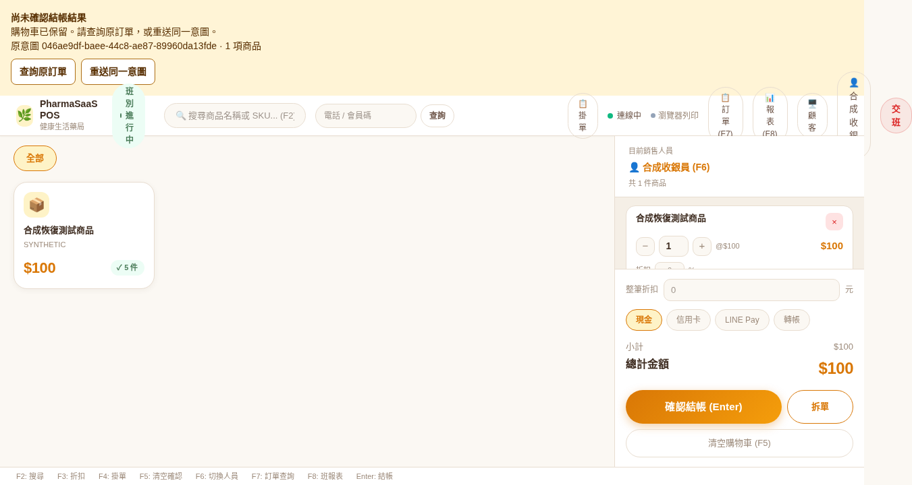
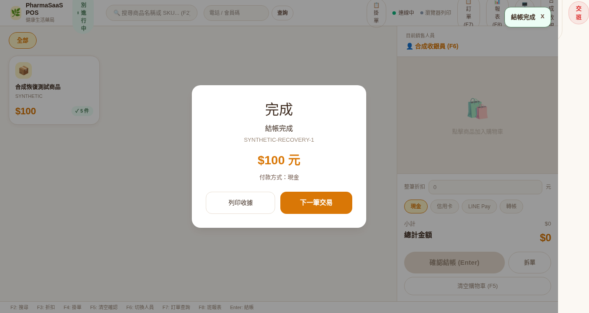

# Bounded #30 checkout recovery evidence

2026-10-06; original base master d8790798. #44 was merged at 13:19:07 UTC as
`12c415d5e677e38ec2dfa23d425c600d7395080e`. No production data, deployment,
permissions or credentials changes were part of that slice. #30 and #29/#31/#37
gates remain open. The [real HTTP restart/lost-response follow-up](http-restart/README.md)
is a separate Draft test/evidence slice and does not authorize merge or deployment.

## Passed

| Evidence | Result |
| --- | --- |
| Complete backend suite | 29 files / 239 tests |
| New command coverage | 19 real PostgreSQL cases + 2 backend/browser hash contract vectors |
| Complete POS suite | 25 files / 151 tests, including 14 new recovery interactions and 2 hash vectors |
| Backend Prisma generation, build, lint | passed with package-lock / Prisma 6.19.2 |
| POS production build | passed; shared CheckoutPayload requires commandId |
| Prisma migration/schema diff | no difference |
| Agent context and git diff whitespace checks | passed |
| Synthetic Chromium recovery | 8/8: unknown → refresh → query or retry → original confirmed order; conflict stays frozen through disconnect/500/401/403, UNKNOWN and SUCCEEDED lookups, reauthentication and refresh |
| Existing Chromium real API flow | 6/6 on isolated, synthetic-seeded PostgreSQL; checkout/refund keeps physical stock unchanged |
| agent-browser visual verification | login content, controls and navigation present; no browser errors or error overlay |
| Synthetic legacy upgrade | previous nine migrations + product 9 / lot 4 / completed historical order; additive command migration leaves those unchanged and creates zero historical commands |

The first concurrency regression failed against the baseline: six copies of one
command did not all recover the order. It passed after command ownership/result
persistence. Later synthetic browser failures were a test harness route matching
Vite source modules, corrected to `/api/v1/admin/**`. No failing acceptance test
is being hidden by mocks or skip conditions.

The PostgreSQL suite checks concurrent same-key copies, a different-payload race,
HTTP 409 with no additional writes, default/line-order normalization, tenant/RBAC,
uncommitted UNKNOWN, last-unit contention, single-method payment records, foreign
keys and result-state CHECK. Failure injection occurs **after actual database
writes** at command claim, product debit, batch debit, order/items/payment create,
movement, allocation and command result. A PostgreSQL payment trigger separately
rejects payment insertion. Every failure rolls back balances and all sale records;
the original command remains retryable.

Separate command-service Node processes verify SIGKILL before commit and a discarded
response after commit followed by a new process replay. These are actual process
termination/restart tests, not just a fresh PrismaClient. The process worker invokes
the real checkout service without an HTTP host. Original result recovery remains
unchanged after closing the shift, changing price, consuming all stock and refunding.
The legacy Chromium suite uses the actual local HTTP API; the new recovery Chromium
suite uses synthetic HTTP responses and is not database concurrency evidence.

## Conflict review correction and raw execution logs

Independent review found that a failed GET could downgrade a known conflict to
unknown and re-enable resubmission after refresh. Four parameterized regression
cases (disconnect, 500, 401, 403) reproduced that failure before the fix. The store
now refuses every downgrade of known conflict, while the hook retains the manual
investigation message. Successful UNKNOWN/SUCCEEDED lookups cannot unlock it,
including a matching hash. No backend, migration or dependency change was needed.

The six additional unit cases preserve the exact saved record through lookup and
hydration and call both ordinary and split-payment submission entries without
another POST. Synthetic Chromium exercises actual Tab + Enter/Space, disabled
retry/ordinary/split controls, 401 login renewal and refresh with exactly one POST.
The original unknown → query/retry → confirmed cases still pass.

Captured stdout/stderr, including test names, totals and build output:

- [POS unit suite: 25 files / 151 tests](raw/pos-unit-conflict-review.txt)
  — `npm test` from `pos-ui`.
- [Synthetic Chromium recovery: 8/8](raw/chromium-conflict-recovery.txt)
  — `PLAYWRIGHT_BROWSERS_PATH=/workspace/.cache/playwright npm run test:e2e -- e2e/checkout-recovery.spec.ts` from `pos-ui`.
- [Existing local HTTP checkout/refund: 6/6](raw/chromium-http-checkout.txt)
  — the same browser command with `e2e/checkout-flow.spec.ts`, using the original
  explicitly started test API and loopback synthetic PostgreSQL database.
- [POS production build](raw/pos-build-conflict-review.txt) — `npm run build` from `pos-ui`.

The optional re-audit of the running API process's `/proc/.../environ` was denied
by filesystem permissions and stopped. The shell did not stop the HTTP test run
after that audit failed; the 6/6 log is therefore evidence against the original
explicit test-server startup configuration, not a successful process-environment
re-audit. No escalation or alternate environment-read route was used.

## Reproduce

Use a new local PostgreSQL database, never a real store connection. All fixtures are
synthetic. Backend CI uses PostgreSQL 15 and migrate deploy; local evidence used
PostgreSQL 15.18 on loopback port 55432. Set DATABASE_URL explicitly for every
backend command and supply test-only JWT secrets.

```sh
# systems/enterprise-admin/backend
npm ci
npm run db:generate
npx prisma migrate deploy
npm run db:seed
npm test
npm run build
npm run lint

# systems/enterprise-admin/pos-ui (workspace dependencies already installed)
npm test
npm run build
npm run test:e2e:install
npm run dev -- --host 127.0.0.1
# Separate terminal, no backend needed for synthetic recovery:
npm run test:e2e -- e2e/checkout-recovery.spec.ts
# checkout-flow.spec.ts needs the local backend and synthetic seed only.
```

Never point the legacy E2E suite at a store: its setup closes the synthetic test
cashier's active shifts. Build scripts/lockfiles and cloud settings are unchanged.

## Screenshots

Both screenshots contain only the synthetic UI fixture.





## Remaining review and limits

- Independent review and final remote CI status must be checked on the latest PR
  commit. This evidence does not authorize merge or deployment.
- Backend/POS must eventually ship together: clients without commandId cannot
  checkout. No historical command is inferred; old orders cannot be recovered by
  a command they never had.
- Conflict records stay frozen for operator investigation. Permanent business
  rejection currently also retains the original draft/command; editing/abandoning
  a proven rejected command needs an explicitly designed workflow. No silent
  replacement or false confirmation is introduced.
- Intent storage is per tenant/cashier/browser. Simultaneous first submission from
  multiple tabs sharing that same localStorage is not covered; one active POS tab
  per cashier/browser is the verified UI boundary. Separate terminals and concurrent
  API commands are covered by the PostgreSQL identity/stock boundary. Clearing or
  tampering with browser storage is not a durable offline-ledger guarantee.
- The original #44 run had separate command-process restart and HTTP happy-path
  evidence. The [follow-up](http-restart/README.md) now verifies real HTTP
  post-commit lost-response → API restart → browser refresh → GET/resend together.
  Before-commit HTTP kill, deadlock/serialization retries, full offline sync,
  mixed-writer production G1/G2/G4, restore rehearsal and final-host checks remain
  outside this slice.
- Unique order numbers/business date, exact money, historical cost snapshots and
  refund reconciliation remain #30 follow-up. The old last-order+1 sequence can
  collide for distinct commands on different products; payment rows are records,
  not provider charges. No parent issue is closed.
